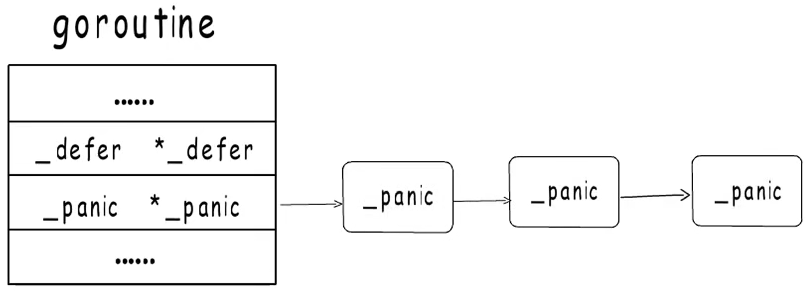

基于 go1.22.6 版本


在 go 语言中，一个 当前执行的 Goroutine 结构体中有一个 defer 链表的头指针和一个 panic 链表的头指针



每一个 panic 由一个 _panic 结构体表示，发生新的 panic 时，是在链表头部插入新的 _panic 结构体，链表头上的 _panic 就是当前正在执行那一个

```go
// A _panic holds information about an active panic.
//
// A _panic value must only ever live on the stack.
//
// The argp and link fields are stack pointers, but don't need special
// handling during stack growth: because they are pointer-typed and
// _panic values only live on the stack, regular stack pointer
// adjustment takes care of them.
type _panic struct {
    argp unsafe.Pointer // pointer to arguments of deferred call run during panic; cannot move - known to liblink
    arg  any            // argument to panic
    link *_panic        // link to earlier panic

    // startPC and startSP track where _panic.start was called.
    startPC uintptr
    startSP unsafe.Pointer

    // The current stack frame that we're running deferred calls for.
    sp unsafe.Pointer
    lr uintptr
    fp unsafe.Pointer

    // retpc stores the PC where the panic should jump back to, if the
    // function last returned by _panic.next() recovers the panic.
    retpc uintptr

    // Extra state for handling open-coded defers.
    deferBitsPtr *uint8
    slotsPtr     unsafe.Pointer

    recovered   bool // whether this panic has been recovered
    goexit      bool
    deferreturn bool
}
```


panic 关键字会被编译器转为调用 runtime.gopanic 函数，其实现如下：

```go
// The implementation of the predeclared function panic.
// The compiler emits calls to this function.
//
// gopanic should be an internal detail,
// but widely used packages access it using linkname.
// Notable members of the hall of shame include:
//   - go.undefinedlabs.com/scopeagent
//   - github.com/goplus/igop
//
// Do not remove or change the type signature.
// See go.dev/issue/67401.
//
//go:linkname gopanic
func gopanic(e any) {
	if e == nil {
		if debug.panicnil.Load() != 1 {
			e = new(PanicNilError)
		} else {
			panicnil.IncNonDefault()
		}
	}

	gp := getg()
	if gp.m.curg != gp {
		print("panic: ")
		printpanicval(e)
		print("\n")
		throw("panic on system stack")
	}

	if gp.m.mallocing != 0 {
		print("panic: ")
		printpanicval(e)
		print("\n")
		throw("panic during malloc")
	}
	if gp.m.preemptoff != "" {
		print("panic: ")
		printpanicval(e)
		print("\n")
		print("preempt off reason: ")
		print(gp.m.preemptoff)
		print("\n")
		throw("panic during preemptoff")
	}
	if gp.m.locks != 0 {
		print("panic: ")
		printpanicval(e)
		print("\n")
		throw("panic holding locks")
	}

	var p _panic
	p.arg = e

	runningPanicDefers.Add(1)

	p.start(getcallerpc(), unsafe.Pointer(getcallersp()))
	for {
		fn, ok := p.nextDefer()
		if !ok {
			break
		}
		fn()
	}

	// If we're tracing, flush the current generation to make the trace more
	// readable.
	//
	// TODO(aktau): Handle a panic from within traceAdvance more gracefully.
	// Currently it would hang. Not handled now because it is very unlikely, and
	// already unrecoverable.
	if traceEnabled() {
		traceAdvance(false)
	}

	// ran out of deferred calls - old-school panic now
	// Because it is unsafe to call arbitrary user code after freezing
	// the world, we call preprintpanics to invoke all necessary Error
	// and String methods to prepare the panic strings before startpanic.
	preprintpanics(&p)

	fatalpanic(&p)   // should not return
	*(*int)(nil) = 0 // not reached
}
```

